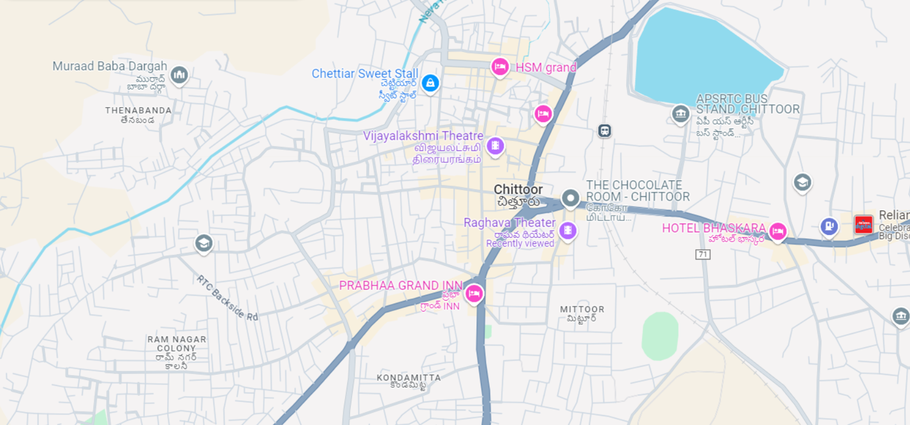

# Ex04 Places Around Me
# Date:
# AIM
To develop a website to display details about the places around my house.

# DESIGN STEPS
## STEP 1
Create a Django admin interface.

## STEP 2
Download your city map from Google.

## STEP 3
Using <map> tag name the map.

## STEP 4
Create clickable regions in the image using <area> tag.

## STEP 5
Write HTML programs for all the regions identified.

## STEP 6
Execute the programs and publish them.

# CODE
```
image map

<html>
    <head>
        <title>MY CITY</title>
    </head>
    <body>
        <h1 align="center">
            <font color="red"><b>CHITTOOR</b></font>
        </h1>
        <h3 align="center">
            <font color="blue"><b>E. Sai Ram</b></font>
        </h3>
        <center>
            
            img src="imagemap1.png.png" usemap="#image-map">

            <map name="image-map">
                <area target="" alt="CHETTIAR SWEET STALL" title="CHETTIAR SWEET STALL" href="C:\Users\admin\OneDrive\Documents\web\chettiar.html" coords="483,157,665,82" shape="rect">
                <area target="" alt="HOTEL BHASKARA" title="HOTEL BHASKARA" href="C:\Users\admin\OneDrive\Documents\web\bhaskara.html" coords="1026,337,1243,409" shape="rect">
                <area target="" alt="PRABHA GRAND INN" title="PRABHA GRAND INN" href="C:\Users\admin\OneDrive\Documents\web\web ex5\ex5\ex5app\prabha grand inn.html" coords="758,496,515,412" shape="rect">
                <area target="" alt="RAGHAVA THEATER" title="RAGHAVA THEATER" href="C:\Users\admin\OneDrive\Documents\web\raghava.html" coords="705,326,907,403" shape="rect">
                <area target="" alt="THE CHOCOLATE ROOM" title="THE CHOCOLATE ROOM" href="C:\Users\admin\OneDrive\Documents\web\the chocolate room.html" coords="907,270,1089,326" shape="rect">
            </map>
        </center>
    </body>
</html>

chettiar.html

<html>
<body bgcolor="white">
    <h1 align="center">
        <font  size="10" color="red">
            CHITTOOR
        </font>
    </h1>
    <h2 align="center">
        
        CHETTIAR SWEET STALL
    
    </h2>
    <hr>
    <h3>
        <center> 
        
        </center>
        <br>
        <hr>
        <li>
            <font size="4">
                Chettiar Sweet Stall is a popular sweet shop located in Chittoor Bazar, Chittoor, Andhra Pradesh. Situated at 7-52, Damayanthi Street,
                 Thotapalyam, the stall boasts a very good rating of 4.8 stars based on online reviews. Known for its delicious sweets, it ranks among
                  the top sweet shops in the area
                
        </li>
        <br>
        <li>
            <font size="4">
                
Chettiar Sweet Stall is a beloved sweet shop located in Chittoor Bazar, Chittoor, Andhra Pradesh. Situated at 7-52, Damayanthi Street, Thotapalyam,
 the stall has earned a very good rating of 4.8 stars based on online reviews. It is known for its wide variety of delicious sweets, making it one 
 of the top sweet shops in the area
            </font>
        </li>
        <br>
        <li>
            <font size="4">
                The stall is registered under GST with the number 37DWIPP8677R1Z1 and operates as a proprietorship. With its high rating and popularity,
                 Chettiar Sweet Stall is a must-visit for anyone with a sweet tooth in Chittoor.
 
            </font>
        </li>
    </h3>
</body>

</html>

theatre.html

<html>
<body bgcolor="white">
    <h1 align="center">
        <font  size="10" color="red">
            CHITTOOR
        </font>
    </h1>
    <h2 align="center">
        
        RAGHAVA THEATRE
    
    </h2>
    <hr>
    <h3>
        <center> 
        
        </center>
        <br>
        <hr>
        <li>
            <font size="4">
                Raghava Theatre, also known as MKS Raghava A/C 2K Dolby 7.4 SURROUND, is located at Jail Khana Street,
                 Mittoor, Chittoor, Andhra Pradesh. It offers a fantastic cinematic experience with the latest movies
                  in 2K resolution and Dolby 7.4 surround soun
                
        </li>
        <br>
        <li>
            <font size="4">
                
                The theatre ensures a comfortable viewing experience with air conditioning and follows safety measures
                 like contactless security checks, in-cinema social distancing, and sanitization
            </font>
        </li>
        <br>
        <li>
            <font size="4">
                This theatre ensures that viewers have a comfortable and enjoyable time by providing air conditioning
                 and adhering to strict safety measures like contactless security checks, in-cinema social distancing,
                  and regular sanitization processes.
 
            </font>
        </li>
    </h3>
</body>

</html>

chocolate room.html

<html>
<body bgcolor="white">
    <h1 align="center">
        <font  size="10" color="red">
            CHITTOOR
        </font>
    </h1>
    <h2 align="center">
        
        THE CHOCOLATE ROOM
    
    </h2>
    <hr>
    <h3>
        <center> 
        
        </center>
        <br>
        <hr>
        <li>
            <font size="4">
                The Chocolate Room is a delightful dessert and waffle outlet located in Mittoor, Chittoor, Andhra Pradesh.
                 Situated at Shop No: 20-106, Second Floor, Naidu Building, this spot is perfect for chocolate lovers and
                  dessert enthusiasts
                
        </li>
        <br>
        <li>
            <font size="4">
                
                STILL MORE
The Chocolate Room in Mittoor, Chittoor, Andhra Pradesh, is a charming dessert and waffle outlet that has gained popularity 
among locals and visitors alike. Located at Shop No: 20-106, Second Floor, Naidu Building, this café is a paradise for 
chocolate lovers and dessert enthusiasts.
            </font>
        </li>
        <br>
        <li>
            <font size="4">
                They offer an array of delicious treats, from rich, indulgent chocolates to mouth-watering waffles,
                 making it a perfect spot for anyone with a sweet tooth. The ambiance is cozy and welcoming,
                  ideal for enjoying a relaxing time with friends or family
 
            </font>
        </li>
    </h3>
</body>

</html>

prabha grand inn.html

<html>
<body bgcolor="white">
    <h1 align="center">
        <font  size="10" color="red">
            CHITTOOR
        </font>
    </h1>
    <h2 align="center">
        
        PRABHA GRAND INN
    
    </h2>
    <hr>
    <h3>
        <center> 
        
        </center>
        <br>
        <hr>
        <li>
            <font size="4">
                Prabhaa Grand Inn is a prominent business-class hotel located at 15-2143, Rajiv Gandhi Road,
                 MSR Circle, Chittoor, Andhra Pradesh 517001. Offering 30 luxurious air-conditioned rooms,
                  including Executive Rooms, Club Rooms, and Suite Rooms, the hotel provides a range of amenities such as free Wi-Fi,
                   parking, CCTV surveillance, an elegant conference hall, and an elevator.
                
        </li>
        <br>
        <li>
            <font size="4">
                Guests can enjoy a bar and restaurants that serve both vegetarian and non-vegetarian delicacies.
                 Conveniently situated near major landmarks like the Railway Station and Bus Stand
            </font>
        </li>
        <br>
        <li>
            <font size="4">
               it is  close to shopping areas, the hotel is also near attractions like Pandava Theertham.
                 With a high rating of 4.5 stars on TripAdvisor, Prabhaa Grand Inn ensures a comfortable and enjoyable stay
 
            </font>
        </li>
    </h3>
</body>

</html>

bhaskara.html

<html>
<body bgcolor="white">
    <h1 align="center">
        <font  size="10" color="red">
            CHITTOOR
        </font>
    </h1>
    <h2 align="center">
        
       HOTEL BHASKARA
    
    </h2>
    <hr>
    <h3>
        <center> 
        
        <br>
        <hr>
        <li>
            <font size="4">
                Hotel Bhaskara is a reputed business-class hotel located at 2-1240, Officers Lane, KR Palli, Chittoor, Andhra Pradesh.
                 Just a 5-minute drive from Chittoor Railway Station and the APSRTC Bus stand, it offers 66 luxurious and well-appointed rooms
        </li>
        <br>
        <li>
            <font size="4">
                Hotel Bhaskara in Chittoor, Andhra Pradesh, is a distinguished business-class hotel known for its exceptional service and top-notch amenities.
                 Located at 2-1240, Officers Lane, KR Palli, the hotel is just a short 5-minute drive from Chittoor Railway Station and the APSRTC Bus stand,
                  making it highly accessible for travelers
            </font>
        </li>
        <br>
        <li>
            <font size="4">
                Guests at Hotel Bhaskara can enjoy complimentary Wi-Fi, ample parking space, and 24-hour room service, ensuring a hassle-free stay.
                 The hotel also includes a well-equipped conference hall, making it an ideal choice for business meetings and events
 
            </font>
        </li>
    </h3>
</body>

</html

```

# OUTPUT



.png>)
# RESULT
The program for implementing image maps using HTML is executed successfully.
